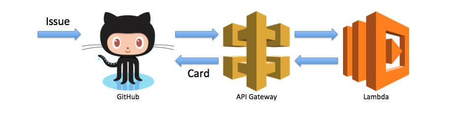

# GitHubIssueProjectSync

Qiita 「[AWS Lambda で GitHub の Projects 機能を Issue と連動させて Trello の代替とする](http://qiita.com/exabugs/items/16bc3786309819c7096e)」



### Install
```
$ npm install github_issue_project_sync --save
```

### Tutorial

```
const lambda = require('github_issue_project_sync');

// GitHub Private Access Token
process.env.token = 'xxxxxxxxxxxxxxxxxxxxxxxxxxxxxxxxxxxxxxxx';

// GitHub Webhooks Recent Deliveries
const event = {
  headers: {
    'X-Hub-Signature': 'sha1=154b3b05dc8689ad3c54224ca6bae5befc897510'
  },
  body: JSON.stringify(require("./payload.json"))
};

const context = {
  succeed: response => {
    console.log(response);
  },
  fail: e => {
    console.log(e);
  }
};

lambda.handler(event, context);
```
